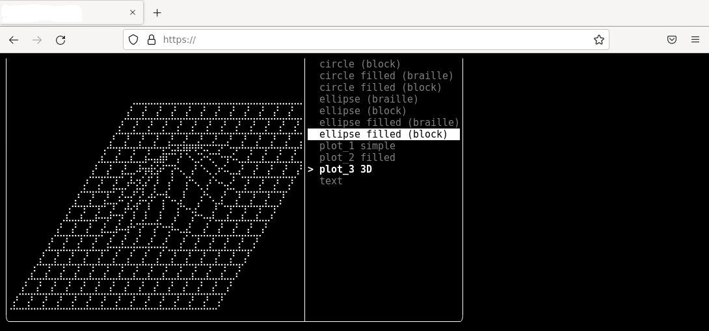
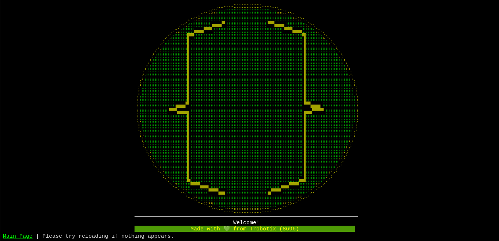

# tralloy


📺 🐁 A template to make cheap / retro style console-based web applications.  
**Heavily** based on [ftxui-starter](https://github.com/ArthurSonzogni/ftxui-starter) by Arthur Sonzogni.  
For a more customized build experience, this discussion may help: [What flags to compile without CMake, only with g++ via command line?](https://github.com/ArthurSonzogni/FTXUI/discussions/262)
## Requirements

| Name               | Description |
| ------------------ | ----------- |
| Python             | For web testing. Optional. |
| Emscripten         | WebAssembly compiler. |
| g++ / clang / msvc | Native compiler. Optional. |
| GNU Make           | Build automation tool. |
| CMake              | Fetch FTXUI and generate Makefiles. |
| npm                | Install Xterm.js. |

## Dependencies
> **Note**
> Xterm.js plugins *fit* and *webgl* must be installed too.

| Name       | Description |
| ---------- | ----------- |
| [Xterm.js](https://github.com/xtermjs/xterm.js)  | JavaScript terminal emulator for console graphics. Installed from npm or caches (jsdelivr). |
| [FTXUI](https://github.com/ArthurSonzogni/FTXUI) | C++ library for console graphics by Arthur Sonzogni. Fetched from CMake. |

## Modifying
1. Replace all occurances of *tralloy* in `CMakeLists.txt` and `src/index.html` with your own project's name.  
2. Erase the demo found in `src/main.cpp`.  
3. Make desired changes in C++. FTXUI documentation can be found [here](https://github.com/ArthurSonzogni/FTXUI).  
> WebAssembly builds, using the HTML file provided, should keep in mind that an FTXUI resize function in `screen_interactive.hpp` is called from JavaScript. The program will not run if this function is not found. Or one could remove the function from the HTML.  
> Supplemental functions are declared in `addons/include`. Currently, only a persistent storge abstraction has been implemented as files written from C++ in the WASM runtime are erased upon page reload.
## Build Instructions
> **Note**
> Assumes the environment is a Linux distribution.
### Native Build
```bash
mkdir native
cd native
cmake ..
# About the maximum concurrency on a 1GB RAM environment.
# Omit 10 to build as fast as possible.
# Initial build will take the longest due to compiling FTXUI into static libraries.
make -j 10
# Use the executable name you selected.
./tralloy
```
### WebAssembly Build
```bash
mkdir wasm
cd wasm
mkdir xterm
# Copy xterm.js, xterm.css, and the two addons into this folder from node_modules.
# Alternatively, you could ignore this step and use a cached version in the HTML from jsdelivr.
emcmake cmake ..
# Same thing applies here from native builds.
make -j 10
python ../test_server.py
# Visit localhost:8000 in a browser.
```
## Deployment
```bash
# Run the WebAssembly build and return to the parent directory.
# Alternatively, you could conduct the build itself in the docs folder.
# But be sure to remove or ignore any excess items.
mkdir docs
cp -r wasm/*.png wasm/*.html wasm/*.js wasm/*.wasm wasm/xterm docs
```
Push changes to GitHub, enable GitHub Pages on the main branch using the `docs` folder, and 🎇.  
You may need to refresh the page once.
> **Note**
> As of the time writing this, browsers that support WebAssembly
> are blocking some features behind HTTP headers for security (search SharedBufferArray).
> The headers can be supplied through the Python program or JavaScript service worker.
## Licenses
Copyright 2022 Trobotix. See the license file for more details.  
Licenses for [FTXUI](https://github.com/ArthurSonzogni/FTXUI/blob/master/LICENSE) and [Xterm.js](https://github.com/xtermjs/xterm.js/blob/master/LICENSE).
